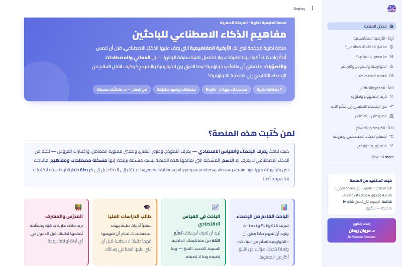
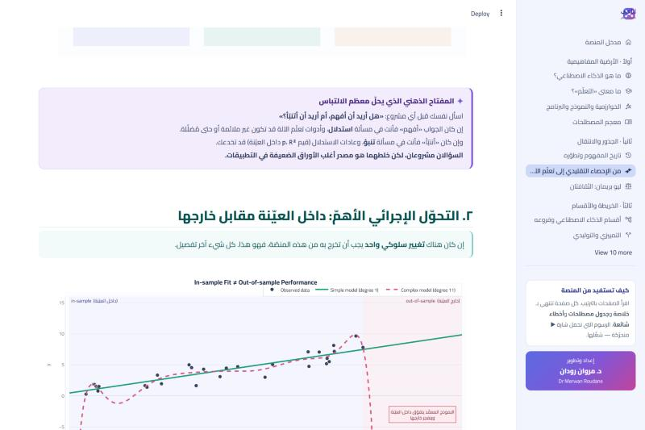
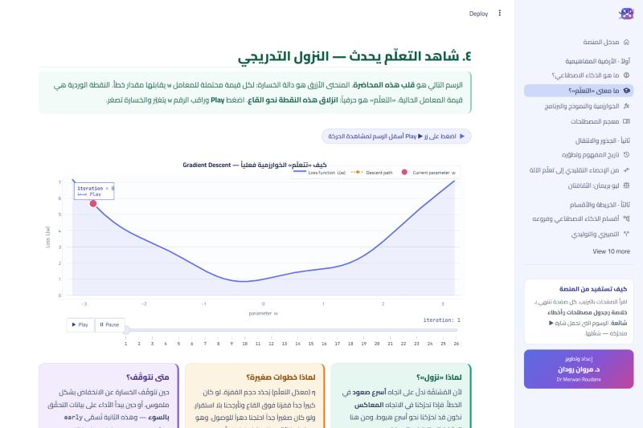
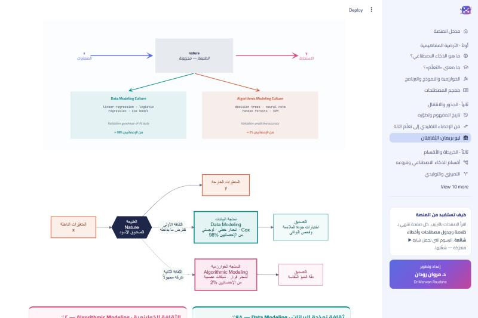
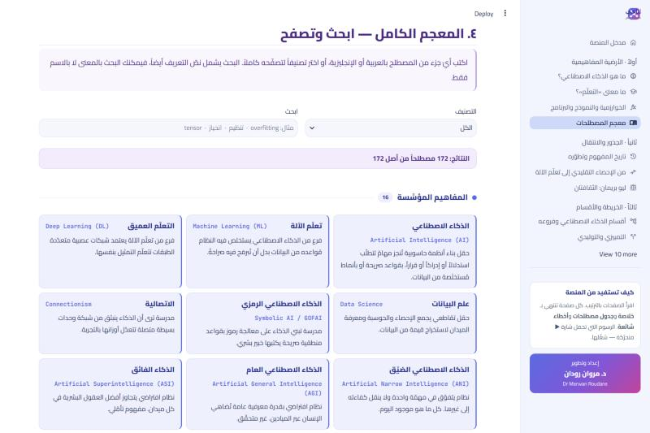
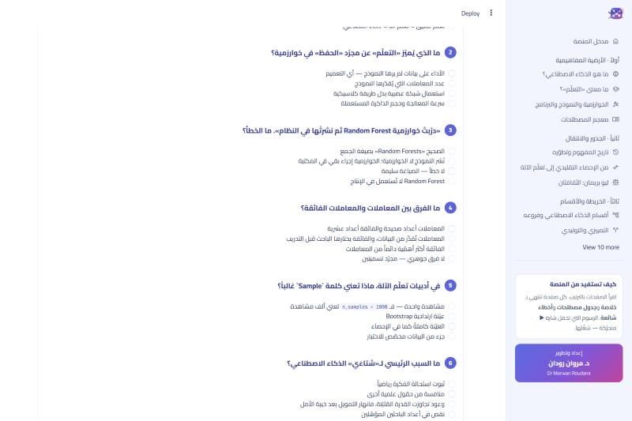

<div dir="rtl">

# مفاهيم الذكاء الاصطناعي للباحثين

### منصّة تعليمية نظرية — من الصفر، وما قبل الصفر

[](https://streamlit.io)
[](https://www.python.org)
[](LICENSE)
[](#محتوى-المنصّة)
[](#المعجم)

منصّة نظرية مُحكمة تبني لك **الأرضية المفاهيمية** التي يقف عليها الذكاء الاصطناعي —
قبل أن تلمس أداةً واحدة ولا سطر كود. ليست دورة تطبيقية، ولا تفاصيل تقنية سابقة
لأوانها، بل **المعاني والمصطلحات والتصوّرات**: ما معنى أن «تتعلّم» الآلة؟ وما الفرق
بين الخوارزمية والنموذج؟ وكيف انتقل العالم من الإحصاء التقليدي إلى النمذجة الخوارزمية؟

**إعداد وتطوير: د. مروان رودان — Dr Merwan Roudane**

</div>

---

<div dir="rtl">

## لمن كُتبت هذه المنصّة؟

كُتبت لباحثٍ **يعرف الإحصاء والقياس الاقتصادي** — يعرف النموذج، وطرق التقدير،
ومعنوية المعاملات، واختبارات الفروض — لكنه عن الذكاء الاصطناعي لا يعرف إلا الاسم.

المشكلة التي تعالجها ليست نقص ذكاء ولا نقص رياضيات، بل **مشكلة مصطلحات ومفاهيم**:
الباحث حين يقرأ ورقةً فيها `training` و `loss` و `hyperparameter` و `generalization`،
لا يفتقر إلى الذكاء، بل إلى **خريطة دلالية** تربط هذه الكلمات بما يعرفه أصلاً.

| الفئة | ما تجده هنا |
|---|---|
| **الباحث القادم من الإحصاء** | جدول ترجمة كامل بين مفردات الحقلين، ومحاضرة مخصّصة لما ينتقل معك وما يجب أن تُعلّقه |
| **الباحث في القياس الاقتصادي** | الفرق بين الاستدلال والتنبؤ، وجسور `Double ML` و `Causal Forests`، ونقد لوكاس في سياقه الجديد |
| **طالب الدراسات العليا** | أرضية مفاهيمية مُحكمة قبل الدخول في الأدوات، وأداة قراءة نقدية للأوراق |
| **المدرّس والمشرف** | مادّة نظرية جاهزة ومصنّفة، قابلة للتقديم مباشرةً أو للاقتباس |

</div>

---

## لقطات من المنصّة

### الصفحة الرئيسية



<div dir="rtl">

واجهة كاملة من اليمين إلى اليسار، شريط تنقّل على اليمين، وهوية لونية فاتحة مختلفة
لكلّ محاضرة من المحاضرات العشرين.

</div>

### من الإحصاء التقليدي إلى تعلّم الآلة



<div dir="rtl">

المحاضرة المحورية للباحث الإحصائي: الفرق بين الملاءمة داخل العيّنة والأداء خارجها،
وهو التحوّل السلوكي الأهمّ في الانتقال بين الحقلين.

</div>

### رسوم متحرّكة تفاعلية



<div dir="rtl">

سبعة من الرسوم التسعة والعشرين **متحرّكة بزرّ ▶ Play**: النزول التدريجي، وفرط
التخصيص، والتنظيم، ومنحنى التعلّم، والتجميع، وأثر راشومون، والانتشار الأمامي والعكسي.
تُشاهد المفهوم يحدث بدل أن تقرأ عنه.

</div>

### ليو بريمان · الثقافتان



<div dir="rtl">

محاضرة كاملة مخصّصة لورقة بريمان (2001) بأقسامها — راشومون، وأوكام، وبلمان — مع
ردود كوكس وإفرون وهودلي وبارزِن، ومآل الجدل بعد عشرين عاماً.

</div>

### معجم المصطلحات التفاعلي



<div dir="rtl">

**172 مصطلحاً** في عشرة تصنيفات، قابلة للبحث بالعربية أو الإنجليزية أو بنصّ التعريف
نفسه — فتبحث بالمعنى لا بالاسم فقط.

</div>

### اختبار ذاتي تشخيصي



<div dir="rtl">

**31 سؤالاً** مع تصحيح فوري، وشرح لكلّ إجابة، وتشخيص يدلّك على المحاضرات التي
تستحقّ إعادة قراءة. تقييم تكويني لا امتحان.

</div>

---

<div dir="rtl">

## محتوى المنصّة

### أولاً · الأرضية المفاهيمية

| # | المحاضرة | أبرز ما فيها |
|---|---|---|
| 01 | **ما هو الذكاء الاصطناعي؟** | سبعة تعريفات، رباعية Russell & Norvig، المدرستان الرمزية والاتصالية، ANI/AGI/ASI |
| 02 | **ما معنى «التعلّم»؟** | تعريف Mitchell وأركانه الخمسة، التعميم، فرط التخصيص، التنظيم، `No Free Lunch` |
| 03 | **الخوارزمية والنموذج والبرنامج** | الفرق الذي يُخطئ فيه الأكثرون، `Parameters` مقابل `Hyperparameters` |
| 04 | **معجم المصطلحات** | 172 مصطلحاً قابلاً للبحث، وجدول الترجمة بين الحقلين |

### ثانياً · الجذور والانتقال

| # | المحاضرة | أبرز ما فيها |
|---|---|---|
| 05 | **تاريخ المفهوم وتطوّره** | من أرسطو إلى اليوم، سبعة عصور، شتاءان، مفارقة بولانيي، البنية المتكرّرة |
| 06 | **من الإحصاء التقليدي إلى تعلّم الآلة** | التحوّلات السبعة، تسرّب البيانات، ماذا ينتقل وماذا يُعلَّق، جسر `Ridge` و `Lasso` |
| 07 | **ليو بريمان · الثقافتان** | الصندوق الأسود، راشومون، أوكام، بلمان، والنقاش مع المُعلّقين الأربعة |

### ثالثاً · الخريطة والأقسام

| # | المحاضرة | أبرز ما فيها |
|---|---|---|
| 08 | **أقسام الذكاء الاصطناعي وفروعه** | أربعة محاور تصنيف متوازية، أنماط التعلّم، أنواع المهامّ |
| 09 | **التمييزي والتوليدي** | `P(y\|x)` مقابل `P(x,y)`، مبدأ فابنيك، جذر الذكاء التوليدي |
| 10 | **الشبكات العصبية والتعلّم العميق** | العصبون = انحدار + لاخطّية، التعلّم بالتمثيل، فرضية المنطوي، القيود الستّة |
| 11 | **النماذج الكبيرة والذكاء التوليدي** | التضمين، الانتباه، مراحل التدريب الثلاث، قوانين القياس، لماذا تُهلوس بنيوياً |

### رابعاً · التطبيق والتأهيل

| # | المحاضرة | أبرز ما فيها |
|---|---|---|
| 12 | **التطبيقات في الواقع والبحث** | ثورة القياس في العلوم الاجتماعية، خمس حالات إخفاق موثّقة ودروسها |
| 13 | **المهارات المطلوبة** | ثلاثة ملامح وثلاثة مسارات، وما **لا** تحتاجه توفيراً لوقتك |
| 14 | **الأساس الرياضي والإحصائي** | جرد ما تملكه أصلاً، الأعمدة الأربعة، جدول ترجمة الرموز |

### خامساً · ما بعد التقنية

| # | المحاضرة | أبرز ما فيها |
|---|---|---|
| 15 | **فلسفة المفهوم** | تورنج، الغرفة الصينية، تأريض الرمز، مشكلة الاستقراء عند هيوم، الوعي |
| 16 | **الأخلاقيات والقيود والمخاطر** | مصادر التحيّز الثلاثة، نظرية استحالة العدالة، فجوة المسؤولية، قائمة فحص |
| 17 | **مغالطات وتصوّرات خاطئة** | أكثر من 40 مغالطة في ستّ فئات، وأداة قراءة نقدية بتسعة أسئلة |

### سادساً · الخاتمة

| # | المحاضرة | أبرز ما فيها |
|---|---|---|
| 18 | **خطة التعلّم والمصادر** | ثلاثة مسارات، خطة 12 أسبوعاً، 15 ورقة أساسية، مصادر مُنتقاة ومُبرَّرة |
| 19 | **اختبر فهمك** | 31 سؤالاً بتصحيح وشرح وتشخيص للثغرات |

</div>

---

<div dir="rtl">

## البنية الموحّدة لكلّ محاضرة

كلّ محاضرة تتبع الهيكل نفسه، فيبقى العمق متوازناً ويعرف القارئ أين يجد ما يريد:

</div>

```
┌─ ترويسة ملوّنة ─────────── تأطير المحاضرة وأبرز ما فيها
├─ أقسام مرقّمة ──────────── شرح موسّع بالمفاهيم لا بالكود
├─ مخطّطات ورسوم ────────── Plotly + Mermaid، سبعة منها متحرّكة
├─ جدول مصطلحات ─────────── العربية · English · التعريف الدقيق
├─ الخلاصة ──────────────── ما يجب أن تخرج به
├─ أخطاء شائعة ──────────── التصوّر الخاطئ ← التصحيح
└─ المصادر ──────────────── مراجع موثّقة بـ DOI
```

---

<div dir="rtl">

## التشغيل محلّياً

### المتطلّبات

- Python 3.10 أو أحدث
- Streamlit 1.57 أو أحدث (المنصّة تستعمل `st.navigation` و `st.mermaid_chart`)

### الخطوات

</div>

```bash
git clone https://github.com/merwanroudane/lectai.git
cd lectai
```

```bash
python -m venv .venv && source .venv/Scripts/activate
```

```bash
pip install -r requirements.txt
```

```bash
streamlit run streamlit_app.py
```

<div dir="rtl">

ثمّ افتح `http://localhost:8501` في المتصفّح.

</div>

---

<div dir="rtl">

## بنية المشروع

</div>

```
lectai/
├── streamlit_app.py           # نقطة الدخول والتنقّل بين الصفحات
├── requirements.txt
├── .streamlit/
│   └── config.toml            # ثيم فاتح، خطّ Cairo، لوحة ألوان متعدّدة
├── app_pages/                 # 20 صفحة — محاضرة لكلّ ملفّ
│   ├── p00_home.py
│   ├── p01_what_is_ai.py
│   └── ...  p19_quiz.py
├── utils/
│   ├── ui.py                  # RTL + 18 مكوّن عرض موحّد
│   ├── palette.py             # هوية لونية فاتحة لكلّ صفحة
│   ├── figures.py             # 29 رسماً، 7 منها متحرّكة
│   └── glossary.py            # 172 مصطلحاً في 10 تصنيفات
├── assets/
│   └── logo.svg
└── docs/screenshots/
```

---

<div dir="rtl">

## ملاحظات تقنية

| الجانب | التفصيل |
|---|---|
| **الاتّجاه** | RTL كامل، والشريط الجانبي على اليمين، مع `dir="rtl"` في كلّ مكوّن |
| **الخطوط** | Cairo للنصّ، JetBrains Mono للكود والمصطلحات اللاتينية |
| **الألوان** | ثيم فاتح حصراً، و20 هوية لونية متمايزة — واحدة لكلّ صفحة |
| **الرسوم** | Plotly للرسوم والحركة، Mermaid للمخطّطات الانسيابية |
| **المصطلحات** | بالإنجليزية داخل النصّ العربي لتبقى قابلة للبحث في الأدبيات |
| **التحقّق** | العشرون صفحة مُختبَرة بـ `streamlit.testing.v1.AppTest` بلا استثناءات |

</div>

---

<div dir="rtl">

## المراجع الأساسية

المنصّة تستند إلى مراجع موثّقة، وتُدرج في كلّ محاضرة مصادرها بـ DOI. أبرزها:

- **Breiman, L.** (2001). *Statistical Modeling: The Two Cultures*. *Statistical Science* 16(3). [`10.1214/ss/1009213726`](https://doi.org/10.1214/ss/1009213726)
- **Shmueli, G.** (2010). *To Explain or to Predict?* *Statistical Science* 25(3). [`10.1214/10-STS330`](https://doi.org/10.1214/10-STS330)
- **Mullainathan, S. & Spiess, J.** (2017). *Machine Learning: An Applied Econometric Approach*. *JEP* 31(2). [`10.1257/jep.31.2.87`](https://doi.org/10.1257/jep.31.2.87)
- **Athey, S. & Imbens, G.** (2019). *Machine Learning Methods That Economists Should Know About*. [`10.1146/annurev-economics-080217-053433`](https://doi.org/10.1146/annurev-economics-080217-053433)
- **Kapoor, S. & Narayanan, A.** (2023). *Leakage and the Reproducibility Crisis in ML-based Science*. *Patterns* 4(9). [`10.1016/j.patter.2023.100804`](https://doi.org/10.1016/j.patter.2023.100804)
- **Turing, A. M.** (1950). *Computing Machinery and Intelligence*. *Mind* LIX(236). [`10.1093/mind/LIX.236.433`](https://doi.org/10.1093/mind/LIX.236.433)

</div>

---

<div dir="rtl">

## المساهمة

ملاحظات التصحيح والإضافة مُرحَّب بها عبر **Issues** و **Pull Requests** — خصوصاً:

- تصحيح مصطلح أو ترجمة غير دقيقة
- إضافة مرجع موثّق بـ DOI
- تصحيح خطأ علمي أو منهجي

المصطلحات موضعها [`utils/glossary.py`](utils/glossary.py)، والرسوم [`utils/figures.py`](utils/figures.py).

## الترخيص

MIT — انظر [LICENSE](LICENSE).

</div>

---

<div dir="rtl" align="center">

**إعداد وتطوير**

### د. مروان رودان

Dr Merwan Roudane

[GitHub](https://github.com/merwanroudane) · [merwanroudane920@gmail.com](mailto:merwanroudane920@gmail.com)

</div>
